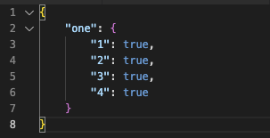
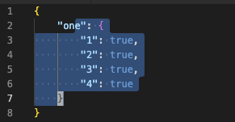
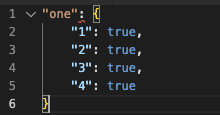

# Copy Without Indent README

Visual Studio Code extension to copy **lines** of text without the initial indent.

It preserves the indentation of the block, but without the initial indentation.  

Therfore, if you had the following json:

You then highlighted a bunch of lines like:

And hit <kbd>Shift</kbd>+<kbd>⌘</kbd>+<kbd>C</kbd> or <kbd>Ctrl</kbd>+<kbd>Shift</kbd>+<kbd>C</kbd> and then pasted the clipboard into a new document, it would look like:

It copies the selected lines (including the initial part of the first line and the full last line), but without the initial indentation.

## Features

- Adds the ability to copy lines/blocks of text without the initial indent, but with all other indentation
- Accessible from the right-click context menu or these keyboard shortcuts:
  - Linux/Windows: <kbd>Ctrl</kbd>+<kbd>Shift</kbd>+<kbd>C</kbd>
  - Mac: <kbd>Shift</kbd>+<kbd>⌘</kbd>+<kbd>C</kbd>
- It will ignore initial lines without text

## Release Notes

### 0.0.4

- Add Icon

### 0.0.3

- Add better description in README and demo images.
- Fix to copy full last line, even if it wasn't fully selected.

### 0.0.2

- Allow to be used with older versions of vscode

### 0.0.1

- Initial release of copy-without-indent
