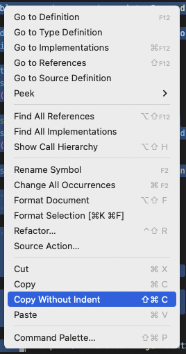

# copy-without-indent README

Visual Studio Code extension to copy text without indent

## Features

- Adds the ability to copy text without the initial indent, but with all other indenting 
- Accessible from the right-click context menu or these keyboard shortcuts:
  - Linux/Windows: <kbd>Ctrl</kbd>+<kbd>Shift</kbd>+<kbd>C</kbd>
  - Mac: <kbd>Shift</kbd>+<kbd>⌘</kbd>+<kbd>C</kbd>
- It will ignore initial lines without text

## Release Notes

### 0.0.1

Initial release of copy-without-indent
